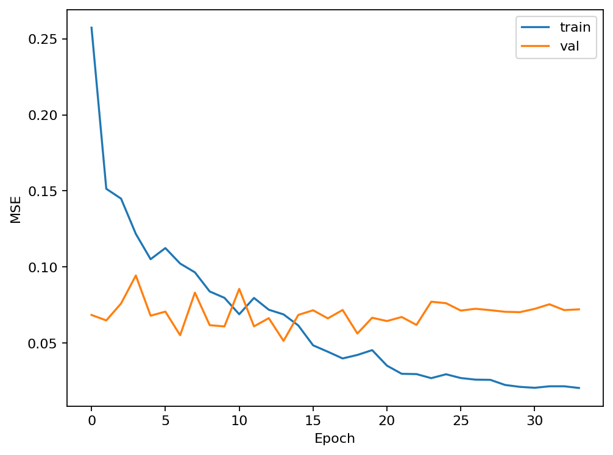
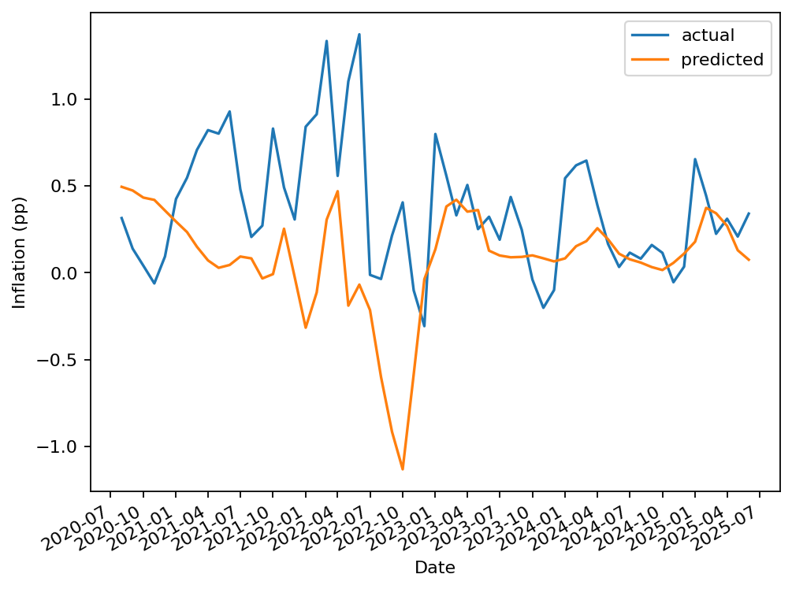

# 📈 Inflation Nowcasting with LSTM


This project implements a **deep learning pipeline for inflation nowcasting** using Long Short-Term Memory (LSTM) networks.  
It leverages macroeconomic data to forecast near-term inflation trends and benchmark them against a simple baseline predictor.

---

## 📂 Repository Structure

```bash
.
├── app/                  # (optional) Deployment app (e.g. Streamlit, FastAPI)
├── notebooks/            # Jupyter notebooks for experiments & EDA
├── results/              # Generated plots & metrics JSON
├── saved_models/         # Trained models & scalers
│   ├── inflation_model.keras
│   └── scaler.pkl
├── src/                  # Core source code
│   ├── config.py         # Global configs (N_LAGS, paths, hyperparams)
│   ├── data.py           # Data loading, preprocessing, scaling
│   ├── forecast.py       # Forecasting pipeline / inference utils
│   ├── model.py          # Model architecture & training loop
│   ├── train.py          # Script to train model end-to-end
│   ├── utils.py          # General utilities
│   └── visualize.py      # Visualization (learning curves, preds vs actuals)
├── LICENSE
├── Makefile              # Automation commands
├── README.md             # Documentation (this file)
├── requirements.txt      # Dependencies
└── .gitignore
```

---

## ⚙️ Installation

Clone the repo and install dependencies:

```bash
git clone https://github.com/<your-username>/inflation-nowcast.git
cd inflation-nowcast
pip install -r requirements.txt
```

---

## 🧠 Training the Model

Train the LSTM model end-to-end:

```bash
python -m src.train
```

This will:  
- Load & preprocess data  
- Train the model  
- Save results under `results/`  
- Save trained model & scaler under `saved_models/`

---

## 🔮 Forecasting

To generate forecasts with a saved model:

```bash
python -m src.forecast
```

This will load the trained model and scaler, then run inference on the most recent data.

---

## 📊 Results & Visualization

During training, the following outputs are generated under `results/`:

- **Learning Curves** (`learning_curves.png`)  
- **Predictions vs Actuals** (`preds_vs_actuals.png`)  
- **Metrics JSON** (`metrics.json`)  

Example:

  


---

## 🏗 Model Architecture

- **Input**: Macroeconomic features over last `N_LAGS` months  
- **Model**: Stacked LSTM with dropout regularization  
- **Output**: Next month’s inflation forecast  

The architecture is defined in [`src/model.py`](src/model.py).

---

## 📌 Baseline

For comparison, we include a **naive baseline**:  
> “Next month’s inflation = last month’s inflation”  

This ensures the LSTM adds value over trivial forecasts.

---

## 📜 License

This project is licensed under the MIT License.  
See [LICENSE](LICENSE) for details.

---

## 🙌 Acknowledgements

- [TensorFlow](https://www.tensorflow.org/)  
- [Keras](https://keras.io/)  
- Public macroeconomic datasets  

---

## 🚀 Future Work

- Add hyperparameter tuning with Optuna  
- Extend features with exogenous variables (oil prices, FX rates, etc.)  
- Deploy model via a Streamlit app (`app/`)  
- Build interactive dashboards with `plotly`

---

👨‍💻 Author: **[Jiany Samara](https://github.com/Jiany-S)**  
