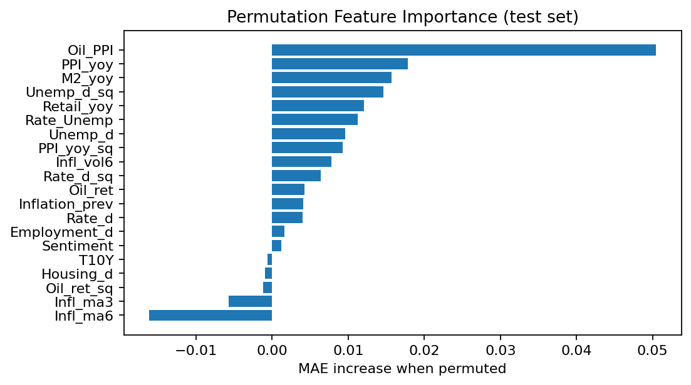

# 📈 Inflation Nowcasting with LSTM


This project implements a **deep learning pipeline for inflation nowcasting** using Long Short-Term Memory (LSTM) networks.  
It leverages macroeconomic data to forecast near-term inflation trends and benchmark them against classical baselines.

---

## 📂 Repository Structure

```bash
.
├── app/                  # (optional) Deployment app (Streamlit, FastAPI, etc.)
├── notebooks/            # Jupyter notebooks for experiments & EDA
├── results/              # Generated plots & metrics
│   ├── backtest_metrics.json
│   ├── baselines.json
│   ├── coverage.txt
│   ├── feature_importance.json / .png
│   ├── learning_curves.png
│   ├── metrics.json
│   ├── preds_vs_actuals.png
├── saved_models/         # Trained models & scalers
│   ├── inflation_model.keras
│   └── scaler.pkl
├── src/                  # Core source code
│   ├── config.py
│   ├── data.py
│   ├── forecast.py
│   ├── model.py
│   ├── train.py
│   ├── utils.py
│   └── visualize.py
├── tests/                # Unit tests
├── LICENSE
├── Makefile
├── README.md
├── requirements.txt
└── .gitignore
```

---

## ⚙️ Installation

```bash
git clone https://github.com/<your-username>/inflation-nowcast.git
cd inflation-nowcast
pip install -r requirements.txt
```

---

## 🧠 Training

```bash
python -m src.train
```

This will:  
- Load & preprocess data from FRED  
- Train the LSTM model  
- Save plots & metrics under `results/`  
- Save trained model & scaler under `saved_models/`

---

## 📊 Results

Key artifacts under `results/`:

- **Learning Curves** – training/validation MSE (`learning_curves.png`)  
- **Predictions vs Actuals** – alignment on test set (`preds_vs_actuals.png`)  
- **Feature Importance** – permutation importances (`feature_importance.png`, `feature_importance.json`)  
- **Backtest Metrics** (`backtest_metrics.json`) – fold-by-fold MAE/MSE vs baseline  
- **Baselines** (`baselines.json`) – naive, seasonal naive, ARIMA baselines  
- **Coverage** (`coverage.txt`) – empirical coverage of MC dropout bands  
- **Final Metrics** (`metrics.json`) – final MAE/MSE on test set

Example visualizations:

  
  


---

## 📌 Baseline Comparison

- Naive last value MAE: ~0.31  
- Seasonal naive MAE: ~0.35  
- ARIMA(1,0,0) MAE: ~0.30  
- LSTM folds: MAE ~0.17–0.30 (better than naive in most folds)  
- Final test MAE: ~0.40

---

## 🏗 Model Architecture

- Input: macro features over last `N_LAGS` months  
- Model: stacked LSTM with dropout regularization  
- Output: next month’s inflation forecast

---

## 🚀 Future Work

- Improve uncertainty calibration (current 80% band ≈ 32% empirical coverage)  
- Hyperparameter tuning with Optuna  
- Richer exogenous features (oil, FX, sentiment indices)  
- Interactive dashboards (Streamlit / Plotly)

---

👨‍💻 Author: **[Jiany Samara](https://github.com/Jiany-S)**
